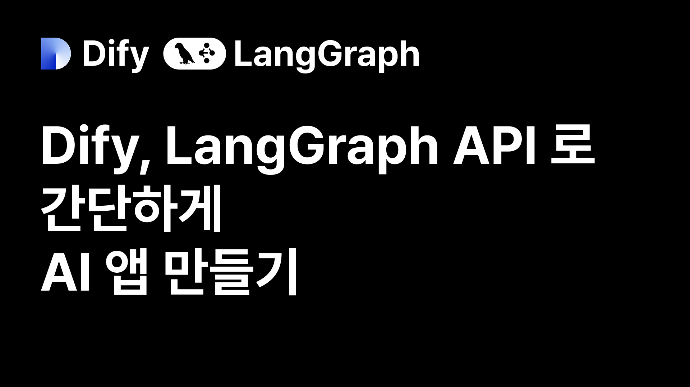

Dify와 LangGraph API를 활용한 AI 앱 배포를 위한 클라이언트 예시를 소개합니다.

## Dify

### 1. 단일 페이지 웹 앱으로 배포

Dify 콘솔에서 바로 싱글 페이지 웹 앱을 내보낼 수 있습니다.

- 좌측 상단 로고, 봇 이미지, 색상 테마 커스터마이징 가능
- Powered By Dify 워터마크 포함

### 2. [웹사이트 내부에 삽입 (Embed)](https://github.com/teddynote-lab/dify-embedding-usecase)

Dify에서 제작한 채팅 앱은 웹사이트에 삽입이 가능합니다.
(단, 워크플로우 앱은 임베드 옵션이 제공되지 않습니다)

- 단일 페이지 웹 앱이 iframe으로 웹사이트에 포함됩니다.

### 3. [StreamLit 앱으로 제작](https://github.com/teddynote-lab/dify-streamlit-usecase)

Dify API를 이용하여 StreamLit 앱을 제작할 수 있습니다.
StreamLit을 이용한 앱 제작에 익숙하신 분이라면 사용해볼 만 합니다.

### 4. [프론트엔드 템플릿 사용](https://github.com/teddynote-lab/dify-webapp-conversation.git)

Dify API를 활용한 공식 프론트엔드 템플릿이 존재합니다.  
Chat / Workflow 두 종류인데 현재 Chat 만 업데이트가 되고 있습니다.

- Next.js 프로젝트 기반
- 프론트엔드 지식이 필요하지만, 간단한 수정으로 배포 가능한 포크 버전을 제공

### 5. AI 클라이언트 사용하기

#### OpenWebUI

OpenWebUI는 Pipeline을 통해 Dify와 연동이 가능합니다.
[예시 코드](https://github.com/teddylee777/dify-openwebui)와 주주총회 영상을 참고해주세요.

#### [TeddyFlow](https://teddyflow.com)

- 100% 노코드로 AI 기능 사용 가능
- B2B SaaS 사내 [AI 어드민 / AI 생산성] 플랫폼
- 현재 베타 서비스 중 (2025년 상반기 내 기능 추가 예정)
  - 애널리틱스
    - 앱별/사용자별 사용량 확인 및 제한 기능
    - 자주 사용되는 키워드 등 사용 데이터 요약 기능
  - 팀 워크스페이스
    - 팀 내 앱 공유 기능
  - 협업 툴 통합
    - Dify, LangGraph 앱을 노코드로 Teams 등 협업툴에 통합
  - 온프레미스 설치 옵션 제공

### 6. 협업 툴에 통합

Discord, Teams, Slack 등 대부분의 협업 툴에 API를 이용하여 통합 가능합니다.
[Discord](https://github.com/teddynote-lab/dify-langgraph-discord-bot)와 [Teams](https://github.com/teddynote-lab/dify-langgraph-teams-bot) 예시 코드를 제공합니다.

## LangGraph Platform

### 1. 프론트엔드 템플릿 사용

[LangGraph 공식 프론트엔드 템플릿](https://github.com/langchain-ai/agent-chat-ui)을 사용할 수 있습니다.

- InputState에 messages를 가진 Graph와 통합 가능
- 프론트엔드 지식 없이도 간단한 수정으로 배포 가능한 [포크 버전](https://github.com/teddynote-lab/langgraph-platform-webapp) 제공

### 2. AI 클라이언트 사용하기

#### OpenWebUI

OpenWebUI는 Pipeline(Python Code)을 통해 LangGraph 코드를 직접 연결할 수 있습니다.
[예시 코드](https://github.com/casedone/langgraph-agent-openwebui-demo)와 [예시 영상](https://www.youtube.com/live/4fg0KGmSjv8)을 참고해보세요.

#### TeddyFlow

노코드로 연동 가능  
공식 프론트엔드 템플릿 내장

### 3. 협업 툴에 통합

Discord, Teams, Slack 등 대부분의 협업 툴에 API를 이용하여 통합 가능합니다.
[Discord](https://github.com/teddynote-lab/dify-langgraph-discord-bot)와 [Teams](https://github.com/teddynote-lab/dify-langgraph-teams-bot) 예시 코드를 제공합니다.

## License

[MIT LICENSE](LICENSE.md)

## Contributing

기여는 언제나 환영합니다! 이슈 등록이나 풀 리퀘스트를 통해 프로젝트에 참여해 주세요. :)
